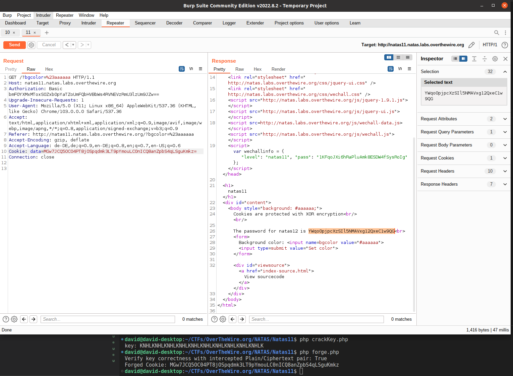

# Natas Level 11

Access data:

    username: natas11
    password: 1KFqoJXi6hRaPluAmk8ESDW4fSysRoIg

Connect to the service using basic HTTP auth by replacing the credentials in the link:
    
    http://*USERNAME*:*FLAG*@*USERNAME*.natas.labs.overthewire.org/

A new form. New source code. Let's have a look....

Ok, we are sending data via a Cookie 'data' to the server. This is somehow parsed by base64 decoding and xor_encryption.  

Observe these lines:

```php
  $tempdata = json_decode(xor_encrypt(base64_decode($_COOKIE["data"])), true); //Parsing Cookie

  setcookie("data", base64_encode(xor_encrypt(json_encode($d)))); //Creating Cookie
```    

We know that 
```php
  $defaultdata = array( "showpassword"=>"no", "bgcolor"=>"#ffffff");
```

is turned into this cookie _MGw7JCQ5OC04PT8jOSpqdmkgJ25nbCorKCEkIzlscm5oKC4qLSgubjY=_ (just checked my default cookie)

We need to forge a cookie that can be decoded in that format but the 'showpassword' value has to be set to 'yes'. For that, we need the key. Luckily, the XOR-'Encryption' leaks the key because we have a known-plaintext  and it's corresponding enciphered text.


Created a little [script](crackKey.php) for this:
```php
  <?php
    $cookie_encoded = "MGw7JCQ5OC04PT8jOSpqdmkgJ25nbCorKCEkIzlscm5oKC4qLSgubjY="; //Known "Ciphertext"
    $cookie_decoded = base64_decode($cookie_encoded); #Remove Base64 Encoding

    $defaultdata = array( "showpassword"=>"no", "bgcolor"=>"#ffffff"); 
    $defaultdata = json_encode($defaultdata); //This is our known plaintext string

    $key = "";
    for($i=0; $i<strlen($defaultdata); $i++){
        $key .= $defaultdata[$i] ^ $cookie_decoded[$i]; //XOR Ciphertext + Plaintext reveals the used key (XOR basics)
    }
    echo "key: " . $key . "\n";

    ?>
```
Output: 

    key: KNHLKNHLKNHLKNHLKNHLKNHLKNHLKNHLKNHLKNHLK

Nice! Key must be **KNHL**!

Now create another [script](forge.php) to forge a cookie with arbitrary values:

```php
  <?php
    function xor_encrypt($in) {
      $key = 'KNHL';
      $text = $in;
      $outText = '';

      // Iterate through each character
      for($i=0;$i<strlen($text);$i++) {
      $outText .= $text[$i] ^ $key[$i % strlen($key)];
      }

      return $outText;
    }

    function forgeCookie($d) {
        return base64_encode(xor_encrypt(json_encode($d)));
    }

    #Optional: Verify the key is correct
    $defaultdata = array( "showpassword"=>"no", "bgcolor"=>"#ffffff");
    $defaultcookie = "MGw7JCQ5OC04PT8jOSpqdmkgJ25nbCorKCEkIzlscm5oKC4qLSgubjY=";
    echo "Verify key correctness with intercepted Plain/Ciphertext pair: " . ($defaultcookie == forgeCookie($defaultdata) ? "True" : "False") . "\n";

    #Forge the challenge cookie
    $challenge = array( "showpassword"=>"yes", "bgcolor"=>"#ffffff");
    echo "Forged Cookie: " . forgeCookie($challenge) . "\n";

    ?>
```

Output:

    Verify key correctness with intercepted Plain/Ciphertext pair: True
    Forged Cookie: MGw7JCQ5OC04PT8jOSpqdmk3LT9pYmouLC0nICQ8anZpbS4qLSguKmkz

Nice. Just feed the cookie to the server now using Burp and we finally get our well-deserved flag!



<details>
  <summary>Solution</summary>
  Flag: YWqo0pjpcXzSIl5NMAVxg12QxeC1w9QG
</details>