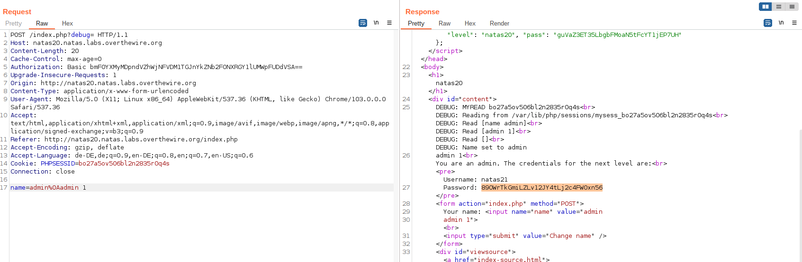

# Natas Level 20

Access data:

    username: natas20
    password: guVaZ3ET35LbgbFMoaN5tFcYT1jEP7UH

Another PHP session related challenge. The meat seems to be within the myread() and mywrite() functions. The commented hints actually confused and lead to dead ends, but just let us look the code. In mywrite() the core lines are this:

```php
    foreach($_SESSION as $key => $value) {
        debug("$key => $value");
        $data .= "$key $value\n";
    }
    file_put_contents($filename, $data);
```

This means, whatever was written to the $_SESSION is stored in a file, separated by \n 
It is read by myread():

```php
    $data = file_get_contents($filename);
    $_SESSION = array();
    foreach(explode("\n", $data) as $line) {
        debug("Read [$line]");
        $parts = explode(" ", $line, 2);
        if($parts[0] != "") {
            $_SESSION[$parts[0]] = $parts[1];
        }
    }
```

We want this condition to be true to get our flag:

```php
    if($_SESSION and array_key_exists("admin", $_SESSION) and $_SESSION["admin"] == 1)
```

The last crucial part we need to observe is this:

```php
    if(array_key_exists("name", $_REQUEST)) {
        $_SESSION["name"] = $_REQUEST["name"];
    }
```

The _name_ parameter from the request is unfiltered written to the session object. 

**Approach**: This time we don't hijack a session, but we modify our own one to get admin rights. Through the unfiltered param we can trick _mywrite()_ to set the admin value in our session file. Just separate the (arbitrary) username value with a _\n_ and append the admin flag + value. Don't forget to URL encode the newline character! And note that you have to send the request twice to have the session reload with the injected settings.




<details>
  <summary>Solution</summary>
  Flag: 89OWrTkGmiLZLv12JY4tLj2c4FW0xn56
</details>


