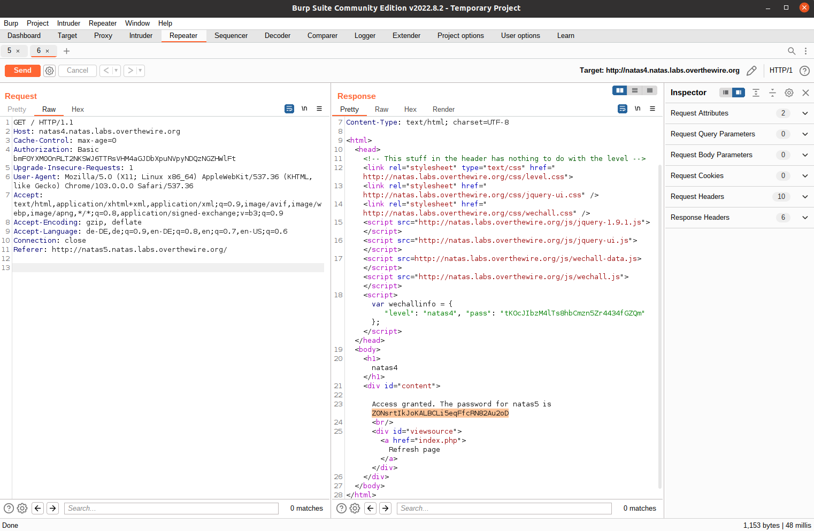

# Natas Level 4

Access data:

    username: natas4
    password: tKOcJIbzM4lTs8hbCmzn5Zr4434fGZQm

Connect to the service using basic HTTP auth by replacing the credentials in the link:
    
    http://*USERNAME*:*FLAG*@*USERNAME*.natas.labs.overthewire.org/

We are greeted with the message:

    Access disallowed. You are visiting from "" while authorized users should come only from "http://natas5.natas.labs.overthewire.org/"

The 'Referer' HTTP Header can be sent alongside requests to tell websites from where a user came to the website. But i can be made up. Let's start up [Burp](https://portswigger.net/burp) and set the Referer manually.

  
Solution

  Flag: Z0NsrtIkJoKALBCLi5eqFfcRN82Au2oD

