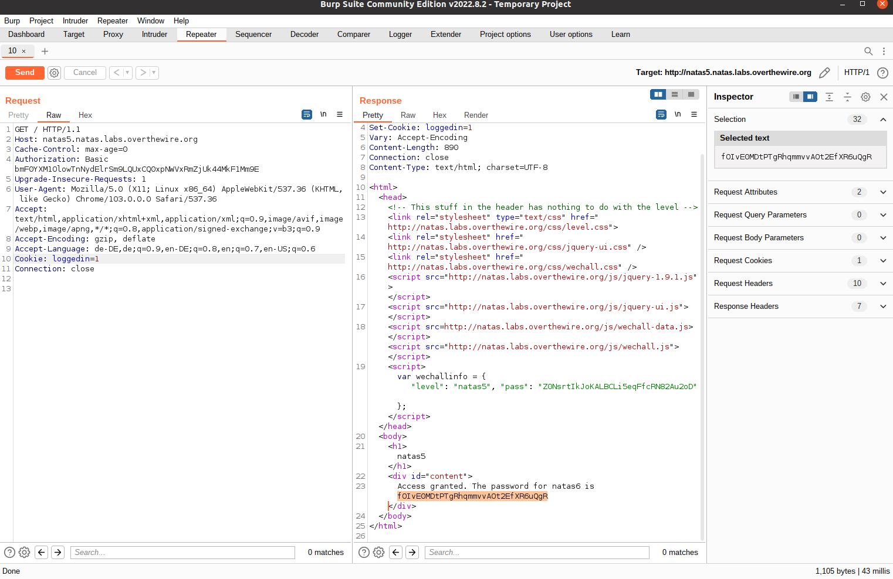

# Natas Level 5

Access data:

    username: natas5
    password: Z0NsrtIkJoKALBCLi5eqFfcRN82Au2oD

Connect to the service using basic HTTP auth by replacing the credentials in the link:
    
    http://*USERNAME*:*FLAG*@*USERNAME*.natas.labs.overthewire.org/

We are told that we are not logged in. Sessions are usually established using Cookies. Indeed, using our Browser to show cookies from the website, we can observe that a cookie "loggedin" with the value "0" is set. 

Well Burp is still running. Repeat the request and set loggedin=1 leads to the solution.

  
Solution

  Flag: fOIvE0MDtPTgRhqmmvvAOt2EfXR6uQgR

